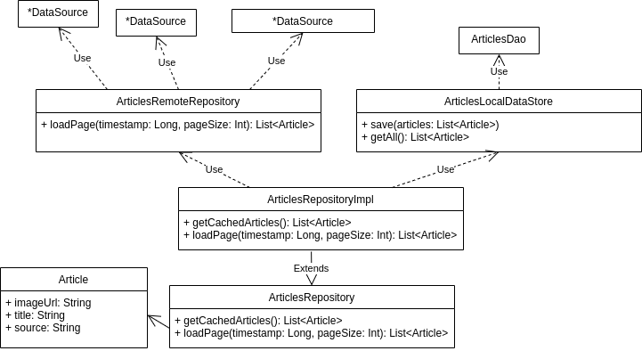
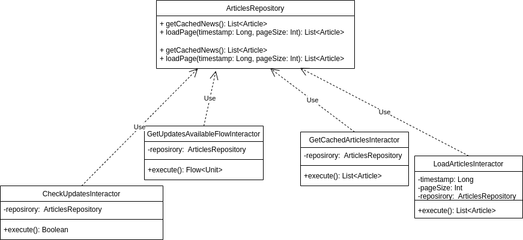

This document describes high-level application architecture and more detailed feature design.

# High-level app architecture

## Common code organization convention
This application is pretty small, so we can afford even don't have any convention. But let's consider situation when other developers will modify/extend it and select one.
If we want other developers (and us) maintain and extend the system, it's better to follow one of common architecture patterns. 

We consider these ones: 
* MVI
* Google recommended Android architecture (MVVM + Repository)
* Clean Architecture.

I prefer to choose MVI if the system has complex state. Current system state doesn't look complex, so let's move to more common patterns.  
This application looks pretty simple, but this is not so. We'll need to combine data sources, implement pagination on them, handle errors, operate data and so on. Most likely, just repository will not be enough. We need to encapsulate all these actions and Clean Architecture has well-defined abstractions for it. Also, it's more common.

Code will be organized using **Clean Architecture**.

## Extensibility
If the application is going to be huge (or just big), best option for extensibility is put features to _feature modules_. This approach requires additional effort on startup: planning common modules and dependencies sharing/injection to feature modules.  
Another option is to use modules related to_ clean architecture layers_, but it requires effort like feature modules and doesn't so flexible, so reject it.

In current case we don't plan to extend, so we can just put all code in single _app_ module. That's what we will use. It's easy to convert to feature modules, but when it will be required, don't forget to design things i've described above.
_app_ module is planned to be small, so it's suitable to organize packages by Clean Architecture layers (if additional functionality required, it will be implemented in other feature module).
#### High-level package structure for features:
* ui
* domain
* data
    * remote
    * local

## Error handling and fault tolerance
Modern approach for errors handling is to try to process all possible errors UX-friendly (show error messages and not to crash). Current application will follow this approach. 

Also, we want to implement errors handling without much effort. In Kotlin all exceptions are unchecked and it can help us.  
Hovewer, since exceptions are not checked, we don't know which exceptions are thrown by every methods, but we still need to handle them somewhere. Since the aplication follows Clean Architecture, it has well-defined structure and data flow. We can consider this and create several rules that allows to handle most of errors properly.   
Rules are:
* All domain and data methods should use throw unchecked exceptions in any exceptional situation. 
* Throwed exceptions should correspond abstraction level of the throwing class and contain all required technical information. 
* When UI layer calls domain layer, it doesn't care about possible exception types. All domain calls are wrapped in `runCatching` block. Default handling is: inform user about error if required and log the exception.  

This approach has disadvantage: if we want to process different types of exceptions in different ways, there might be a problem. E.g. if we want to log to Firebase (or its analog) all exceptions except of network-related. This will require additional design and effort, but that's the price that we pay for convenience.

# News feature design
## Data and Paging
Data sources are encapsulated to _*DataStore_ classes. So we don't care which protocol are used.  
Main challenge with pagination here is that all data stores can provide different pagination mechanisms. It should be encapsulatet: domain layer should provide unified pagination API. 
**Pagination by date** looks the most suitable for our purposes. Every news have a date. Even if original data source doesn't provide such pagination, we can use its pagination mechanism and make requests until receive data with appropriate dates. 

Other questions are how to pass data to UI and where to store it. 
We need persistense storage for caching. Most common solution is to have such cache in database (we don't consider exotic solutions like save JSON in shared prefetences, use plain text files, etc). In our applciation there is no need to choose database by speed and weight. Only convenient API matters in this case. I prefer **Room** ORM because it looks really simple.  

Now we need to define the source of truth. Need to respect these limitations: 
1) Cache size is restricted
2) We want to achieve good performance even for big lists.  
It means that we can't just translate news flow from the database to the UI (dataabase size is restricted, DiffUtil can work slow for big lists).  

Good solution here is to save all newest data to database for caching, and provide such API: `Repository.loadPage(date): List<New>`. UI can just append update to the list.  
I think `MVP` UI pattern is more suitable for such design, but we can also use `MVVM` here. We'll use `MVVM` because it's more common.

## Errors handling
Since there are several data sources, i suppose we can just hide network errors from the user. Error will be shown only if all data requests failed.

## Background check for updates
Background updates should be encapsulated as additional data sources. There will be interactors to provide `subscribe` and `unsubscribe` functionality. We still need to call these methods somewhere in the core component. It can be lifecycle callbacks of the root `Activity` or `Application`. 

## Main classes 
### Data layer

### UI layer

### Domain layer

